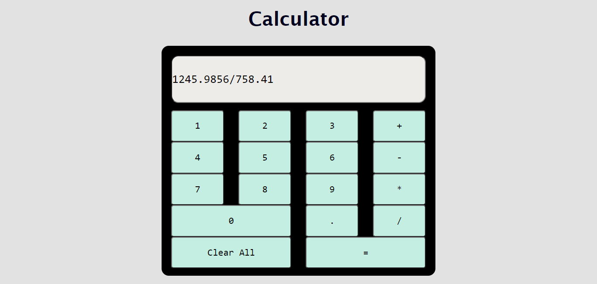
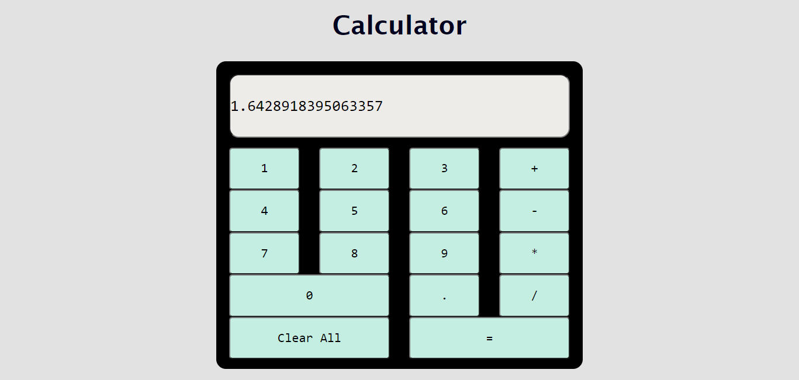
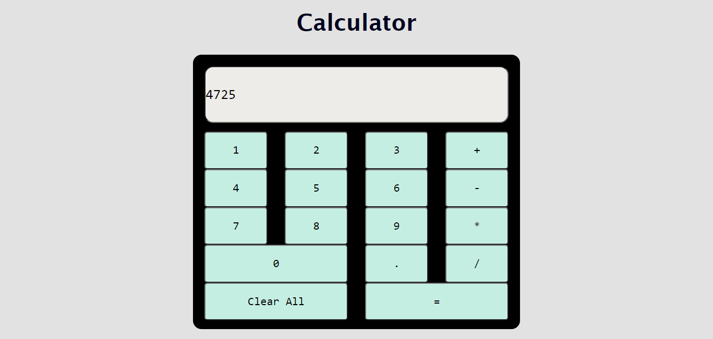

# Calculator
This calculator is developed using HTML, CSS, Bootstrap and JavaScript

Take a Look at : https://keerthana0711.github.io/Calculator/

Preview:

Division Operation:

Multiplication Operation:

